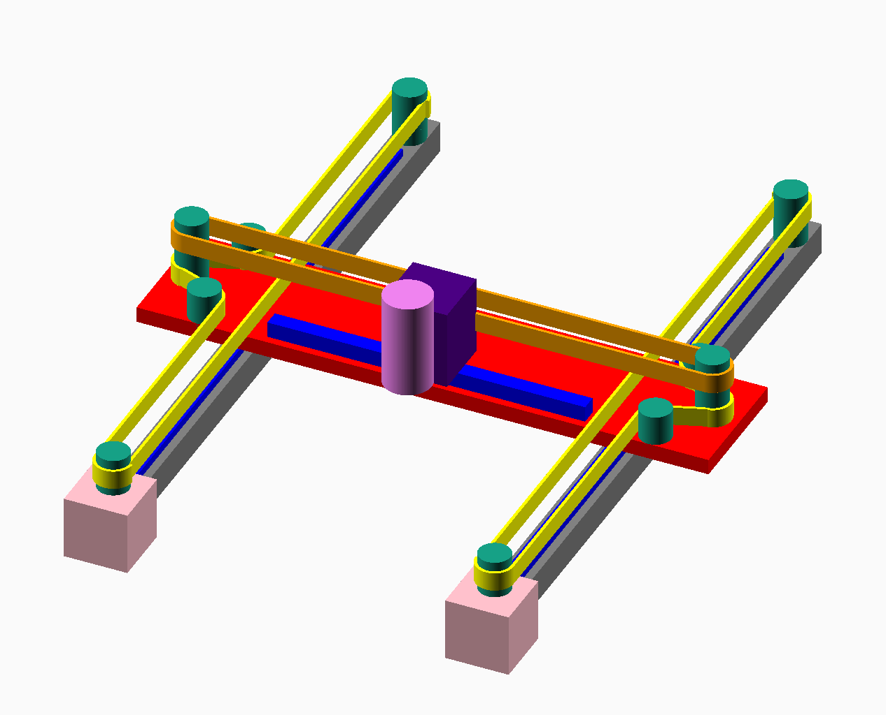

# CoreXrY

#### Author: Eaden McKee

## CoreXrY is a (new?) Kinematic Motion system for 3d printers or CNC machines.

It uses two closed loop belts around the A and B Drives, which each turn a pulley on the X axis. Those pullys each turn a pulley which moves the Y belt, which is connected to the end effector and moves on the Y axis.

The differential motion of the A and B motor can move the end effector in any direction on the X and Y axis.

The motion control software required is the same as CoreXY.

## Possible Advantages
Shorter Belt Lengths. The overall belt length for CoreXrY is shorter than CoreXY.

## Image

(X is vertical, Y is horizontal)

### comments/questions etc. 

For comments or questions, email mail @ [this domain](https://eaden.net). 
